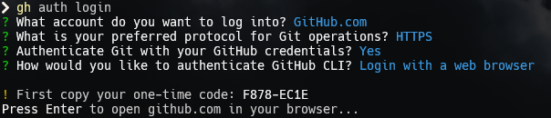
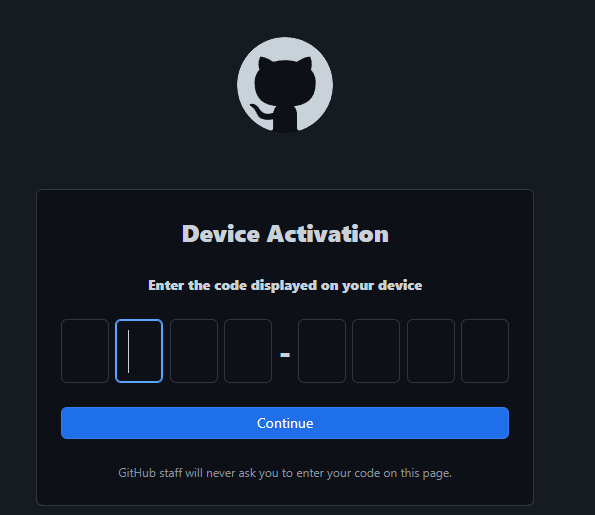

## Application manage

> I used `winget` and `scoop`

### winget

- It default install or your can install in [microsoft store](https://apps.microsoft.com/detail/app-installer/9NBLGGH4NNS1?hl=en-US&gl=US)

### scoop

- fast install app and plugins not need role admin ([link](https://scoop.sh/#/))

```bash
Set-ExecutionPolicy RemoteSigned -Scope CurrentUser
irm get.scoop.sh | iex
```

## Git

### Install git

**winget**

```bash
winget install Git.Git
```

**or by scoop**

```bash
scoop bucket add main
scoop install main/git
```

### Fast SignIn Github
>
> Login Github in browser by command line

 1. Login Github in your browser
 2. Install Github CLI

 > [Learn more](https://cli.github.com/)
 **winget**

```bash
winget install GitHub.cli
```

**or scoop**

```bash
scoop bucket add main
scoop install main/gh
```

3. SignIn Github
_Run command_

```bash
gh auth login
```

> My setup

> After it press enter and enter code has generate


### Git UI

[Fork](https://git-fork.com/)

## Node

### NVM

### FNM

